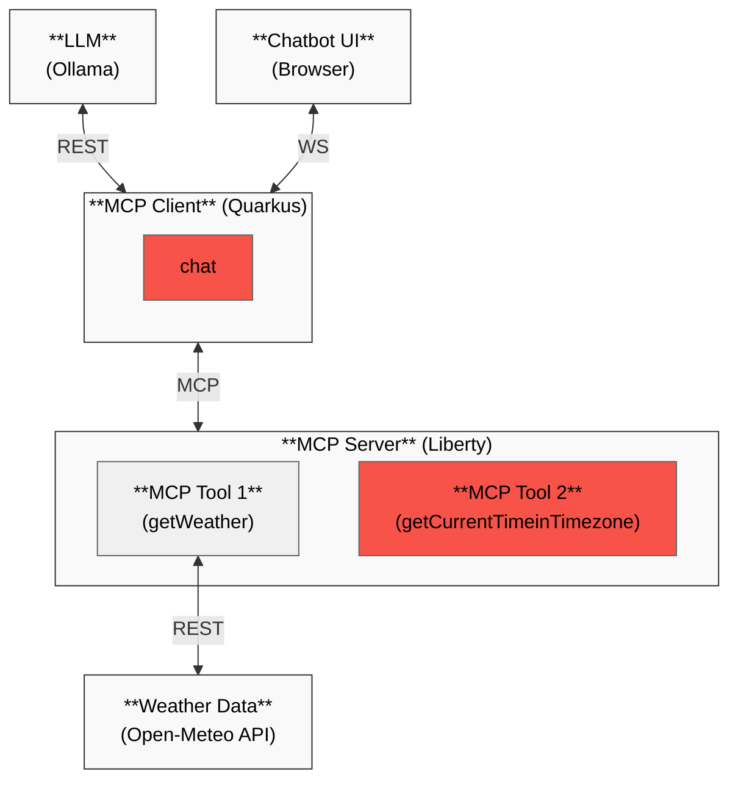

# Overview
This is an extension of the Liberty MCP Demo (https://github.com/mbroz2/liberty-mcp-server). This project explores the possibility of having multiple MCP tools and how to add guardrails to restrict the LLM from going beyond the scopes of the MCP server

As a reminder, the MCP client is based on Quarkus, and the MCP server is running on an Open Liberty server with the microprofile and mcp-server module enabled. Refer to the Liberty MCP Demo repo for more details on the setup and how to run the demo. This demo is to demonstrate Liberty's support for MCP with the new `mcpServer-1.0` module.

# High Level Architecture




# MCP Client

- **MultiToolService.java** - the original **AiWeatherService**'s getWeather tool called directly by the chatbot websocket and restricts all user messages to the tool. Instead the getWeather tool is replaced by a generic `chat` tool that will have a role as a bridge to route the user message to the respective tool. In this example, beside the `getWeather` tool, user can also get the current time of a location via the `getCurrentTimeinTimeZone` tool.

```java
public interface MultiToolService {
    @SystemMessage("""
        You are a helpful assistant capable of calling tools. 
    """)
    @McpToolBox
    String chat(@UserMessage String message);   
}
```

## LLM for Mediating User Messages & Tools

The followings will demonstrate step-by-step of how to add instructions to the `chat` tool enabling routing user message to respective tools as well as adding guardrails to the tool. 

### Scope Definition & User Message/Tools Routing

The `chat` tool will accept a `UserMessage` and pass any message to the LLM model as defined in Quarkus' `application.properties` and will get the response (as described on the `SystemMessage`) directly from the LLM model without calling the MCP server.

To make the `chat` tool play as mediator, we'll need to add additional instructions that define the scope i.e. not to answer directly, but to use the weather and datetime tools from the MCP server by adding the following to the tool description

```java
public interface MultiToolService {
    @SystemMessage("""
        You are a helpful assistant capable of calling tools. 
        Use the provided MCP tools when appropriate.
        The tools to call are getWeather and getCurrentTimeinTimezone
        Do not answer directly - always call the appropriate method
    """)
    @McpToolBox
    String chat(@UserMessage String message);   
}
```

### Formating Response
At this point, the chatbot is capable of calling either the `getWeather` tool or the `dateime` tool to answer respective questions. Next step, we want to format the response e.g. to use Celsius instead of Fahrenheit, to respond in a friendly sentence, etc.

```java
public interface MultiToolService {
    @SystemMessage("""
        You are a helpful assistant capable of calling tools. 
        Use the provided MCP tools when appropriate.
        The tools to call are getWeather and getCurrentTimeinTimezone
        Do not answer directly - always call the appropriate method
        The returned temperatures must be in Celsius, if not convert it to Celsius
        For datetime question, return response in a full friendly English sentence
        
        The only formatting allowed is the following html tags: 
          b, strong, i, em, u, del, small, big, sup, sub, p, h1, h2, h3, h4, h5, h6, br, hr, ul, ol, li
        
    """)
    @McpToolBox
    String chat(@UserMessage String message);

    
}
```

### Guardrails
Since the LLM model will try to respond to all the questions even when it's not related to weather or datetime as the application is designed for, we'll need to add some guardrails to stop the tool from trying to respond to other questions. In this example, if the MCP client can't find a tool matched with the question, it must return an apology message

```java
public interface MultiToolService {
    @SystemMessage("""
        You are a helpful assistant capable of calling tools. 
        Use the provided MCP tools when appropriate.
        The tools to call are getWeather and getCurrentTimeinTimezone
        Do not answer directly - always call the appropriate method
        The returned temperatures must be in Celsius, if not convert it to Celsius
        For datetime question, return response in a full friendly English sentence
        
        The only formatting allowed is the following html tags: 
          b, strong, i, em, u, del, small, big, sup, sub, p, h1, h2, h3, h4, h5, h6, br, hr, ul, ol, li
        If there isn't a tool matched, return with an apology message
    """)
    @McpToolBox
    String chat(@UserMessage String message);

    
}
```
