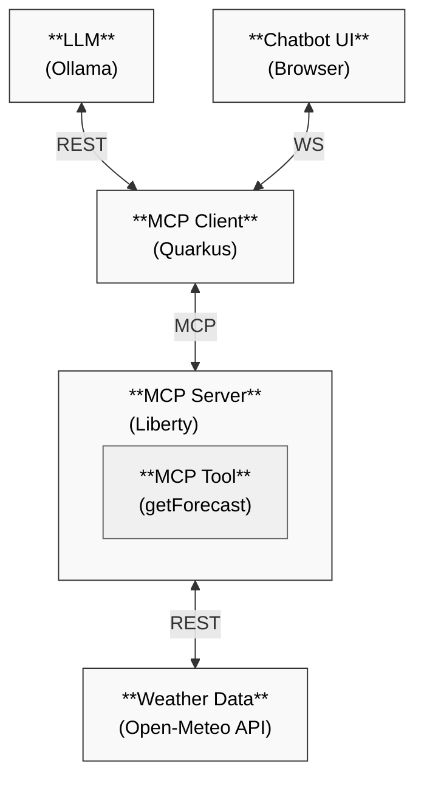

# Liberty MCP Server

This project demonstrates Liberty servings as a Model Context Protocol (MCP) Server (and Quarkus as the MCP Client). The demo showcases how AI applications can leverage external business logic (new or existing) through the use of MCP tools.

## Project Overview

The demo consists of two main components:

1. **Liberty MCP Server**: Provides a weather forecast tool that can be called by MCP clients
2. **Quarkus MCP Client**: A chatbot application that uses the weather forecast tool through MCP

The client application allows users to ask weather-related questions in natural language. The AI model processes these questions and uses the MCP tool provided by the Liberty server to retrieve weather forecasts.

## Prerequisites

- [Java 17+](https://developer.ibm.com/languages/java/semeru-runtimes/downloads/)
- [Ollama](https://ollama.com/download/) or [OpenAI API Key](https://platform.openai.com/account/api-keys)
- (Optional) Maven 3.8.1+ 
  - Alternatively use the provided Maven wrapper via `./mvnw` or `mvnw.cmd`

## Getting Started

### 1. Start the Quarkus Client

```bash
cd mcp-client
./mvnw quarkus:dev
```

The Quarkus application will start on port 8080.

### 2. Start the Liberty Server

```bash
cd mcp-liberty-server
./mvnw liberty:dev
```

The Liberty server will start on port 9080.

### 3. Access the Application

1. Open http://localhost:8080/ in your browser
2. Click the chat icon in the bottom right corner to start a conversation
3. Ask weather-related questions like:
   - What's the 3 day weather forecast for Maui, Hawaii?
   - Will I need an umbrella this week in Austin, TX?
   - Will it snow in the next 4 days in Toronto, Canada?
   - Who's going to see more rainfall this week, Maui, Hawaii or Seattle, Washington?

## How It Works

1. The user sends a weather-related query to the Quarkus client
2. The client uses an LLM (via Ollama or OpenAI) to process the query
3. The LLM determines whether it needs weather data and if so calls the MCP tool
4. The Liberty server receives the tool request and calls the Open-Meteo API
5. The weather data is returned to the MCP client
6. The LLM formats the response and presents it to the user

## Project Structure

- `mcp-client/`: Quarkus MCP client with an application providing an AI chatbot interface
- `mcp-liberty-server/`: Liberty MCP server providing the weather forecast tool

See the README files in each directory for more details about the specific components.
## Architecture
