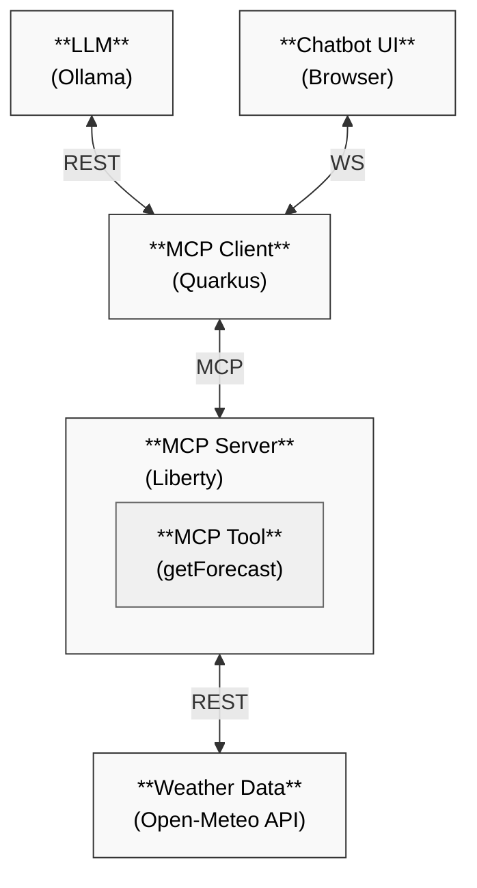

# Liberty MCP Server

This project provides an Open Liberty-based MCP (Model Context Protocol) server that exposes weather forecast tools to MCP clients. The server acts as a bridge between AI applications and business logic/data.

## Technical Overview

The application uses:
- **Open Liberty**: A lightweight, open-source Java runtime
- **MicroProfile**: For REST client and configuration
- **MCP Server Feature**: Liberty's implementation of the MCP protocol
- **Open-Meteo API**: For retrieving weather forecast data

## Key Components

- `WeatherTools`: Implements the MCP tool for weather forecasts using the `@Tool` annotation
- `WeatherClient`: MicroProfile REST client for the Open-Meteo API
- `server.xml`: Liberty server configuration with MCP feature enabled

## Prerequisites

- [Java 17+](https://developer.ibm.com/languages/java/semeru-runtimes/downloads/)
- [Ollama](https://ollama.com/download/) or [OpenAI API Key](https://platform.openai.com/account/api-keys) or [Anthropic API Key](https://docs.claude.com/en/docs/get-started)
- (Optional) Maven 3.8.1+ 
  - Alternatively use the provided Maven wrapper via `./mvnw` or `mvnw.cmd`

## Server Configuration

The Liberty server is configured in `server.xml`:

```xml
<featureManager>
    <feature>microProfile-7.0</feature>
    <feature>mcpServer-1.0</feature>
</featureManager>

<httpEndpoint id="defaultHttpEndpoint"
              httpPort="9080"
              httpsPort="9443" />

<webApplication contextRoot="/mcp-liberty-server" location="mcp-liberty-server.war" />
```

## MCP Tool Implementation

The server exposes a weather forecast tool using the MCP protocol:

```java
@Tool(name = "getForecast", description = "Get weather forecast for a location.")
public String getForecast(@ToolArg(name = "latitude", description = "Latitude of the location") String latitude,
                          @ToolArg(name = "longitude", description = "Longitude of the location") String longitude) {
    // Implementation calls the Open-Meteo API
}
```

## Running the Server

1. Build and run the Liberty server:
   ```bash
   ./mvnw liberty:dev
   ```

The Liberty server will start on port 9080.

### 3. Access the Application

1. Open http://localhost:8080/ in your browser
2. Click the chat icon in the bottom right corner to start a conversation
3. Ask weather-related questions like:
   - What's the 3 day weather forecast for Maui, Hawaii?
   - Will I need an umbrella this week in Austin, TX?
   - Will it snow in the next 4 days in Toronto, Canada?
   - Who's going to see more rainfall this week, Maui, Hawaii or Seattle, Washington?

## How It Works

1. The user sends a weather-related query to the Quarkus client
2. The client uses an LLM (via Ollama, OpenAI or Anthropic) to process the query
3. The LLM determines whether it needs weather data and if so calls the MCP tool
4. The Liberty server receives the tool request and calls the Open-Meteo API
5. The weather data is returned to the MCP client
6. The LLM formats the response and presents it to the user

## Project Structure

- `mcp-client/`: Quarkus MCP client with an application providing an AI chatbot interface
- `mcp-liberty-server/`: Liberty MCP server providing the weather forecast tool

See the README files in each directory for more details about the specific components.
## Architecture
